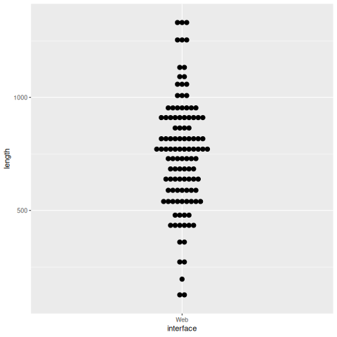

```{r 1_authentification avec rtoot, eval=FALSE, include=FALSE}
library(rtoot)
auth_setup()
# Si ces deux lignes de code ne sont pas exécutées en amont de la compilation (knit) de ce document, une erreur 503 est affichée. 
# Pour exécuter ce chunck, il faut avoir son navigateur et avoir ouvert le compte SO_UnivRennes et donc pour cela disposer de l'identifiant et du mot de passe du compte
```

```{r extraction de données avec rtoot, include=FALSE}
library(readr)
options(readr.show_col_types = FALSE) #voir ici https://github.com/tidyverse/readr/issues/1250
library(rtoot)
library(tidyverse)
library(dplyr)
library(tufte)

last_run_time <- Sys.time()
id <- "112370075539544475"
followers <- get_account_followers(id, limit = 300L)
following <- get_account_following(id, limit = 300L)
lists <- get_account_lists(id, token = NULL, parse = TRUE)
print(lists)
#relationships <- get_account_relationships(id, limit = 300L)
dataframe <- get_account_statuses(id, limit = 400L)
toots <- get_account_statuses(id, exclude_reblogs = TRUE, limit = 400L)
sent <- as.integer(length(dataframe$id))
toots <- as.integer(length(toots$id))
boosts <- (sent - toots)
reblogs <- sum(dataframe$reblogs_count)
favourites <- sum(dataframe$favourites_count)
replies <- sum(dataframe$replies_count)
reply_to <-dataframe$in_reply_to_id

followers_number <- length(followers$id)
following_number <- length(following$id)
#relationships_number <- length(relationships$id)
status_number <- length(dataframe$id)
#print(dataframe)

write_csv(dataframe, "SO_univrennes_toots.csv")
write_csv(followers, "followers.csv")
#write_csv(relationships, "relationships.csv")
#print(followers)
#print(followers_number)
```


```{r replies to users, include=FALSE}

reply_to <- dataframe$in_reply_to_account_id %>%
    .[!is.na(.) & . != "NA"]   #
count_reply_to <- length(reply_to)

```

# Pourquoi nous avons choisi Mastodon

## Périmètre du compte

ARDEL, auquel est rattaché le [compte SO_UnivRennes](https://mastodon.social/@SO_UnivRennes) est le service d'**Appui à la Recherche et à la Documentation En Ligne** (ARDEL) du Service Commun de Documentation (SCD) de l'Université de Rennes. L'activité d'ARDEL ne se limite pas à la Science Ouverte, mais elle y prend néanmoins une part importante dans les fiches de postes de 4 agents sur les 6 que compte le service, exclusive chez 2 d'entre eux. 

Le compte SO_UnivRennes ne parle d'ailleurs pas uniquement de Science Ouverte mais a vocation à partager des informations sur l'ensemble des activités des membres du groupe ARDEL, dans lesquelles on trouve la documentation en ligne gérée par le SCD, les formations doctorales et la gestion des thèses en tant que production scientifique de notre Université. Pour le reste, en effet, la Science Ouverte recouvre la sensibilisation et l'accompagnement des chercheurs et chercheuses (y compris les doctorant.e.s) à la conservation, à la diffusion et au partage des publications dans et depuis HAL, des données dans et depuis Recherche Data Gouv ou d'autres entrepôts de confiance et du code source dans Software Heritage et depuis HAL.

Inversement, au sein de l'Université de Rennes, la Science Ouverte est présente bien au delà de la cellule ARDEL et infuse les politiques de l'Université. Elle dispose d'un chargé de mission qui est aussi chargé de la documentation. 

Ces éléments qui ne figurent pas encore sur la "bio" de notre compte a du être précisée dans un message de réponse à une utilisatrice, enseignante-chercheuse à l'Université de Rennes, qui sollicitait notre avis sur une contradiction apparente entre la théorie et la pratique de la Science Ouverte par notre Université.
Le Service Commun de la Documentation a vocation à contribuer par son expertise à la construction de la politique Science Ouverte de l'Université, mais celle-ci est en dernière instance définie par le conseil scientifique. Le compte SO_UnivRennes communique sur les éléments de cette politique et aide les chercheurs et les chercheuses inscrit.e.s sur Mastodon à la mettre en oeuvre au quotidien.  

## Pourquoi Mastodon

Un service comme ARDEL pourrait se satisfaire de l'usage de son site web pour communiquer et de l'utilisation de flux RSS pour suivre les principales évolutions sur la Science Ouverte et la documentation électronique tant les sources d'information fiables et inspirantes sont nombreuses :  sites de revues spécialisées, sites d'institutions de recherche, de chercheurs et chercheuses, et de personnes appartenant au monde de la documentation et des bibliothèques. Devant le discrédit dans lequel X plonge une partie des autres réseaux sociaux, beaucoup d'individus actifs dans le monde du logiciel ou de la recherche quittent ces plateformes dites "sociales" pour passer plus de temps à lire les billets des sites qu'elles apprécient et à écrire et publier des billets sur leur propre site[¹]. 

### Les flux RSS et les sites web ne suffisent pas

Pour notre part, à titre personnel, mais aussi en tant que service, nous considérons que la fréquentation d'un réseau social ajoute à une veille qui reposerait sur des flux l'apport de conversations entre points de vue parfois opposés sur les objets de notre activité ; être témoins de ces conversations, nous permet de prendre en considération dans notre pratique davantage de points de vue et d'affiner nos réponses en fonction de la situation de nos interlocuteurs et interlocutrices. Prendre part à ces conversations permet a fortiori d'éprouver des arguments au contact de collègues ou de personnels de recherche qui ont une autre expérience de terrain que la nôtre. 

Nous pensons toutefois que ces enrichissements ne peuvent avoir lieu que si leur contexte est parfaitement transparent. 
Par transparence, nous entendons tout d'abord celle de l'algorithme de distribution des message : 
Tout d'abord, nous devons nous assurer que tout ce qui est posté par un.e utilisatreur.ice du réseau nous parvient sans filtre, à la manière d'un flux RSS qui reproduit fidèlement tout ce qui est posté par la personne qu'on suit. Ce n'était plus le cas sur Twitter déjà bien avant qu'Elon Musk ne le rachète. Mastodon n'est qu'un logiciel dont le code source est accessible. Le réseau social Fedivers dépend d'un protocole (ActivityPub) qui préexistait au logiciel Mastodon et son code est également en accès libre. 

### Communiquer, c'est faire du Commun

Nous souhaitons par ailleurs investir du temps dans un Commun, car nous considérons que communiquer, ce n'est pas seulement échanger des messages, mais aussi contribuer au milieu (medium) qui permettra à ces échanges d'avoir lieu. Communiquer, comme le rappelle Arthur Perret, c'est aussi bâtir du Commun (@perretFaireCommun2023a), a contrario des réseaux sociaux centralisés qui privatisent (de la donnée personnelle) et privilégient des points de vue au détriment d'autres par des algorithmes opaques et déloyaux. 

Créer du commun, c'est précisément interroger le medium qu'on utilise, ses règles, ses principes de modération, son articulation avec les médias voisins quand elle est techniquement possible. Par exemple, les instances de Mastodon peuvent techniquement communiquer avec celles de Threads (Meta), mais ne le souhaitent pas pour éviter que le Fédivers ne soit victime de la part de Meta d'une manoeuvre de style **embrace, extend and extinguish**. 

Avec Mastodon, il n'y a pas de propriétaire qui décide de cette interopérabilité pour tout le monde. L'administrateurice d'une instance peut rendre le choix de l'ouverture possible à ses utilisateurices (sans pouvoir la rendre obligatoire) ou bien proposer que la connexion ne soit pas possible pour la raison stratégique évoquée. Ces débats ont lieu au sein des instances avec les utilisateurices. Il n'y pas de procédure de vote à notre connaissance, mais les personnes mécontentes de la décision prise peuvent sans perdre l'accès à leur communauté de followers quitter cette instance pour une autre qui correspond mieux à leurs options d'ouverture (ou de fermeture). Cet exemple, montre qu'il est possible de bâtir des Communs avec Mastodon, alors qu'un gouvernement centralisé dans les mains d'un propriétaire qui dispose de toutes les règles et décide de tous les paramétrages obère d'emblée cette construction.  

### La décentralisation, l'atout maître de Mastodon

Répétons-le, Mastodon n'est qu'un logiciel et pas un réseau social qui permet d'accéder à un réseau structuré par un protocole d'échange, ActivityPub, l'un et l'autre sont libres. 
Pour les utilisateurices de X qui ne supportent pas la dégradation de plus en plus nette de leur expérience sur ce réseau et la toxicité accrue du réseau du fait d'une absence de modération, la difficulté d'intégrer Mastodon est en réalité ce qui constitue la richesse de cet écosystème : Mastodon comporte un grand nombre d'instances de tailles et de politiques différentes, et il faut en choisir une : **Où atterrir ?**

Nous nous sommes évidemment posé la question et nous avons comparé les diverses instances qui accueillent les acteurs de la Science ainsi que celles qui travaillent dans le périmètre de l'Etat. Nous avons d'abord contacté l'instance gérée par la Direction du Numérique (Dinum) qui nous paraissait la plus appropriée, mais faute de réponse de l'administrateur à ce moment-là, nous avons opté pour la solution généraliste *mastodon.social*, celle qui compte le plus grand nombre de comptes hébergés à ce jour. 

Depuis, lors nous avons échangé avec les administrateurs de l'instance *[social.numerique.gouv.fr](https://social.numerique.gouv.fr/explore)* de la [Direction Interministérielle du Numérique](https://www.numerique.gouv.fr/dinum/) qui nous incitent à choisir leur serveur dédié aux services de l'Etat. Dans le même temps, nous sommes en contact avec un agent du [Service interuniversitaire en charge de la mutualisation numérique en île-de-France (UNIF)](https://unif.fr/qui-sommes-nous/). 
L'UNIF se propose de lancer prochainement une instance destinée au monde universitaire qui intègrerait le protocole Shibboleth pour permettre à ses membres d'accéder à leur compte via leurs identifiants universitaires. Cette possibilité rendrait notre compte plus résistant aux attaques d'usurpation, dans la mesure où sur une instance dépourvue de ce type de gestion de droits, il n'est pas possible de mettre en place un système de double authentification impliquant une application idoine sur un smartphone commun. 

Nous avons mentionné la dégradation de l'expérience usager sur une plateforme comme X/Twitter. 
Cory Doctorow qui a étudié ce phénomène commun à nombre de plateformes ultra-dominantes sur le marché à forgé à ce sujet le concept d'**emmerdification** (enshittification). 
Ce phénomène décrit la manière dont les propriétaires d'une plateforme accordent une telle importance au retour sur investissement pour satisfaire la demande actionnariale (ou politique en ce qui concerne Meta et Twitter) que non seulement les demandes des usagers ne sont plus prises en compte, mais de plus celles des partenaires commerciaux (publicitaires) sont également négligées. 

Les usagers, pour ne parler que d'eux, acceptent pendant quelque temps de subir cette dégradation afin de garder aussi longtemps que possible leur communauté et leurs contacts. Car e,n l'espère, partir, signifie perdre le bénéfice de plusieurs années de constructions d'une communauté. C'est pourtant ce à quoi ils/elles douivent se résoudre quand la toxicité sur ces plateformes confinent au harcèlement. 

Aussi pour Cory Doctorow, **ce n'est pas tant le fait que des capitaux privés soutiennent une infrastructure qui condamnent celle-ci à l'emmerdification, mais le fait qu'elle rend ses usagers captifs de cette infrastructure** (@doctorowEnshittificationIsntCaused2024). 

A contrario, comme on l'a vu plus haut, le Fédivers conserve à ses utilisateurices toute latitude pour quitter une instance dont l'administration ou la politique générale leur déplairait pour une autre plus proche de leurs options, et cela sans aucune perte de leur expérience passée. Comptes suivis, followers, listes, messages envoyés accompagnent le ou la migrante vers sa nouvelle maison.

Cory Doctorow observe par ailleurs que si cette liberté est inscrite dans le code du protocole de Bluesky (AT), elle n'est toujours pas enracinée dans une réelle décentralisation et rien ne garantit qu'elle ne le soit un jour (@doctorowBlueskyEnshittification2025). De son point de vue, cette incertitude devrait nous conduire à opter pour une solution qui tient d'emblée ses engagements, ce que fait Mastodon, **enraciné dans le Fédivers (Fediverse), un réseau décentralisé dans sa conception même et depuis ses origines**.

Sur la récente capitalisation de Bluesky, Joan Westenberg a un point de vue divergent de celui de Doctorow. Pointant du doigt l'arrivée massive sur Bluesky d'utilisateurices fuyant X/Twitter, elle pose la question suivante : **est-ce qu'une plateforme financée à coups de le grand capital (elle était évaluée à 700 millions de dollars en décembre 2024) peut réellement servir de refuge à des gens qui fuient l'arbitraire et les obessions des Tech Bros de Meta et X ?** 

Le financement de Bluesky condamne ses administrateurices à la pression d'un retour sur investissement rapide, qui se traduit dans un premier temps par l'ouverture à la publicité (@rothThreadsOfficallyGetting2025) et devrait ensuite prendre les apparences de ce que nous avons déjà observé sur Twitter (@westenbergWhatBlueskys700m2025). 

Ajoutons à cela que des ponts techniques (*bridges*) existent entre les protocoles de Bluesky et de Mastodon, nous en reparlerons. Ces ponts permettent aux utilisateurices de chaque plateforme de suivre celles de l'autre, ces trois raisons (décentralisation effective, organisation à but non lucratif, interopérabilité avec le protocole AT) fait qu'ARDEL n'envisage pas de créer un compte sur Bluesky et de crossposter. 

### Qu'en est-il des autres alternatives : LinkedIn et Threads

Threads partage avec Mastodon un même protocole, mais les règles y sont très différentes. l'algorithme du réseau expose du contenu provenant de comptes qu'on ne suit pas et il est impossible pour l'usager qu'il en soit autrement, on ne peut donc parler d'un algorithme loyal ni transparent. La modération y sera sous peu soumise aux nouvelles régles de "modération" imposées aux équipes de Meta : la modération des contenus ne sera plus confiée à des officines extérieures (rédaction de journaux) mais aux usagers eux-mêmes qui décideront collaborativement de l'acceptabilité d'un post ; un Commun ? cette mesure déjà appliquée à d'autres réseaux de la *Broligarchie* n'aura pas pour effet de garantir la liberté d'expression contre les sachants, mais de déplacer la fenêtre d'Overton encore plus vers la droite (et de la fermer à gauche) selon les intérêts du moment du PDG de Meta.
Bien sûr il y a aussi des instances sur Mastodon tenues par des libertariens et des climaosceptiques, mais nul n'est obligé de s'y inscrire. Il y a tant d'autres instances possibles où atterrir. Piaille par exemple régule les échanges et bannit les contenus ouvertement climatosceptiques en tant que "désinformation" conformément à sa charte [³]. 

Threads, comme Facebook ne sont pas moins orthogonaux que X avec les idéaux d'universalisme et de recherche de la vérité scientifique des universités. Le RGPD commanderait aussi de ne jamais laisser de pouce levé sur une page de nos universités, ce qui revient à laisser constituer des "shadow profiles" à partir des données de navigation de nos usagers, mais on sait ce qu'il en est dans la réalité. Pour les bibliothèques, l'impératif d'aller "où sont nos usagers" semble prévaloir dans les choix opérés à la faveur du #HelloquitteX. Pour autant, cet impératif n'a que rarement incité ces établissements ou les universités à ouvrir un compte sur le réseau Tiktok, un lieu très fréquentés les usagers et usagères des 18-25 ans  l'emporte nettement sur notre recheche de cohérence entre nos valeurs et les outils qu'on utilise, ainsi bien sûr que cette pédagogie du numérique que nous devons à nos étudiants et qui devrait nous inciter à leur présenter de nouvelles manières plus éthiques de communiquer en ligne.


LinkedIn est un réseau largement utilisé par des chercheurs et les chercheuses pour entretenir un réseau professionnel afin d'y trouver une visibilité pour de futurs employeurs et des opportunités de partenariats ou d'embauches. Ces enjeux n'ont que peu de liens avec l'objet qui occupe ARDEL, la Science Ouverte. 
LinkedIn est également un réseau qui illustre le concept de capitalisme de plateforme tel que défini par Shoshana Zuboff. Les données personnelles qui y sont échangées (et vraisemblablement certaines autres qui sont directement prélevées auprès de ou de la nouvelle inscrite) servent à accroître la valeur monétaire du réseau.
La position de LinkedIn vis à vis des contenus générés par des outils d'intelligence artificielle nous semble encore plus problématique. LinkedIn a annoncé récemment que loin de réguler le contenu généré par des IA, (les bots doivent être signalés comme tels sur Mastodon), le réseau facilitait le recours à ces outils en son sein (au titre d'"assistants de rédaction"). Des études récentes estiment à 54% le contenu en anglais présent sur la plateforme qui a été généré avec l'aide d'une IA, et à 23% le contenu entièrement généré par un outil d'IA (@knibbsYesThatVirala). 
La Science Ouverte n'a rien à faire ni rien à gagner dans un univers aussi synthétique. 


# Analyse de notre activité sur Mastodon

L'activité sur Mastodon peut être mesurée et interrogée au moyens d'API. Des collectifs ont commencé à distribuer des librairies pour R et pour Python qui permettent à des chercheurs et chercheuses d'extraire des contenus de la plateforme (listes d'utilisateurs, listes de statuts comportant un mot clé donné sur une instance ou plusieurs). Mais ces librairies sont également utiles pour des administrateurices d'instances afin de connaître le contenu qui transite par leur serveur en interaction avec les autres serveurs fédérés ou aux détenteurs de comptes individuels ou collectifs comme le nôtre. 
Nous avons décidé de mener cette analyse avec un package réalisé pour R, car le mode d'authentification promu par ce package nous a semblé plus simple que celui mis en oeuvre par la [librairie Python](https://mastodonpy.readthedocs.io/en/stable/) conçue pour Mastodon. 

## Le package Rtoot

David Schoch et Chung-Hong Chan sont à l'origine du package Rtoot conçu pour R qu'ils ont présenté dans les colonnes de la revue *Mobile Media & Communication* (@schochSoftwarePresentationRtoot2023a). Ce paquet est téléchargeable [depuis le répertoire du CRAN](https://cran.r-project.org/web/packages/rtoot/index.html). Comme une partie des requêtes possibles par API nécessite une authentification, ce package gère cette authentification au moyen d'un token qui peut être obtenu quand on est connecté au compte à analyser. 

Les commandes qui déclenchent ce processus d'authentification sont indiquées ci-dessous : 

```{r eval=FALSE}
library(rtoot)
auth_setup()
```

Dans la console, l'application demande le nom de l'instance qui héberge le compte. Il faut fournir le nom de cette instance entre guillemets ( "mastodon.social" )
Puis choisir "User" si on veut obtenir les chiffres relatifs à un compte d'utilisateur. 
Si le navigateur est ouvert et que le compte est ouvert sur l'un de ses onglets, en quelques secondes une fenêtre apparaît demandant l'autorisation d'utiliser Rtoot avec le compte en question. Une fois autorisée, cette transaction aboutit à l'affichage d'un jeton (token) sous la forme d'une chaîne de caractères. Du côté de R, un popup demande ce jeton. Lorsque il lui est fourni, il est possible d'exécuter les commandes de Rtoot qui permettent d'obtenir des informations sur l'activité de ce compte. 

Le code source de cette publication fournit les requêtes utilisées pour recueillir les données qui ont permis d'extraire les chiffres qui sont présentés dans ce document. 
Pour utiliser ce code avec un autre compte que celui de SO_UnivRennes, il faut utiliser rtoot pour récupérer l'identifiant numérique du compte (celui de SO_UnivRennes est "112370075539544475") et remplacer notre identifiant par le votre dans la ligne suivante : 

```{r eval=FALSE}
id <- "votre numéro"
```

Pour trouver cet identifiant, on utilise la fonction search_account du package rtoot : 

```{r eval=FALSE}
id <- search_accounts("SO_UnivRennes")
print(id)
# donne 112370075539544475
```

Dans le présent document, les chiffres en bleu et en gras comportent les chiffres obtenus lorsqu'on a exécuté pour la dernière fois la commande auth_setup (=lorsqu'on a compilé le présent document pour la dernière fois), c'est à dire à cette date : <div class="blue">`r last_run_time`</div>.


## Présence de Mastodon dans l'enseignement supérieur français

### Comptes gérés par des universités et instituts de recherche

Une requête Wikidata permet d'obtenir la liste des institutions de recherche qui d'après les données de Wikidata se sont dotées d'un compte Mastodon.
Cette requête peut se faire depuis R au moyen du [package wikidataR](https://cran.r-project.org/web/packages/WikidataR/WikidataR.pdf). 
Le résultat de cette requête est lisible dans le [fichier Wikidata_all.csv](wikidata_all.csv) 

Quels types de comptes "alternatifs" à X/Twitter, Facebook ou Instagram (Meta) les institutions de recherche ouvrent-ils ?  
Nous faisons entrer ici comme *alternatifs* des réseaux que nous en considérons pas comme de réelles alternatives (puisque pour nous seuls les services actuellement présents sur le Fédivers méritent vraiment ce nom). Nous mentionnons ici les services vers lesquels se tournent usagers et institutions lorsqu'ils désirent quitter X ou Facebook. 
La littérature scientifique sur le sujet mentionne essentiellement Mastodon, Bluesky, Threads et LinkedIn comme réseaux de destination et c'est une sélection que nous reprenons à notre compte. 

```{r requête Wikidata tous pays, echo=FALSE}
library(WikidataR)
library(dplyr)
library(ggplot2)
wikidata_df <- query_wikidata('SELECT DISTINCT ?institution ?institutionLabel ?Mastodon ?Bluesky ?LinkedIn ?Facebook ?Threads ?Instagram ?countryLabel WHERE {
  ?institution wdt:P31/wdt:P279* wd:Q31855;
    wdt:P17 ?country .

# Institutions de recherche : wd:Q31855
# bibliothèques : wd:Q7075

  {
    ?institution wdt:P4033 ?Mastodon
  } UNION {
    ?institution wdt:P12361 ?Bluesky
  } UNION {
    ?institution wdt:P4264 ?LinkedIn
  }  UNION {
    ?institution wdt:P11892 ?Threads
  } 
 #   UNION {
 #   ?institution wdt:P2003 ?Instagram
 # } UNION {
 #   ?institution wdt:P2013 ?Facebook
 # }
  
 # pour ajouter Instagram et Facebook décommenter les lignes 14 à 18 ; attention, cela peut excéder le temps défini par défaut d\'une requête (time out) et la requête peut échouer

  SERVICE wikibase:label { bd:serviceParam wikibase:language "[AUTO_LANGUAGE],en". }
}')
spec(wikidata_df)
write.csv(wikidata_df, "wikidata_all.csv")
wikidata_df_masto <- wikidata_df %>% filter(!is.na(Mastodon))
wikidata_df_blue <- wikidata_df %>% filter( !is.na(Bluesky))
wikidata_df_link <- wikidata_df %>% filter(is.na(LinkedIn))
wikidata_df_threads <- wikidata_df %>% filter(!is.na(Threads))
count_mastodon <- length(wikidata_df_masto$Mastodon)
count_bluesky <- length(wikidata_df_blue$Bluesky)
count_linkedin <- length(wikidata_df_link$LinkedIn)
count_threads <- length(wikidata_df_threads$Threads)

count_networks <- c(count_mastodon, count_bluesky, count_linkedin, count_threads)
networks <- c("Mastodon", "Bluesky", "LinkedIn", "Threads")

df_networks <- data.frame(networks, count_networks)
```

```{r include=FALSE}

wikidata_df_libraries <- query_wikidata('SELECT DISTINCT ?institution ?institutionLabel ?Mastodon ?Bluesky ?LinkedIn ?Facebook ?Threads ?Instagram ?countryLabel WHERE {
  ?institution wdt:P31/wdt:P279* wd:Q7075;
    wdt:P17 ?country .

# Institutions de recherche : wd:Q31855
# bibliothèques : wd:Q7075

  {
    ?institution wdt:P4033 ?Mastodon
  } UNION {
    ?institution wdt:P12361 ?Bluesky
  } UNION {
    ?institution wdt:P4264 ?LinkedIn
  }  UNION {
    ?institution wdt:P11892 ?Threads
  } 
 #   UNION {
 #   ?institution wdt:P2003 ?Instagram
 # } UNION {
 #   ?institution wdt:P2013 ?Facebook
 # }
  
 # pour ajouter Instagram et Facebook décommenter les lignes 14 à 18 ; attention, cela peut excéder le temps défini par défaut d\'une requête (time out) et la requête peut échouer

  SERVICE wikibase:label { bd:serviceParam wikibase:language "[AUTO_LANGUAGE],en". }
}')
write.csv(wikidata_df_libraries, "wikidata_libraries.csv")

wikidata_df_libraries_masto <- wikidata_df_libraries %>% filter(!is.na(Mastodon))
wikidata_df_libraries_blue <- wikidata_df_libraries %>% filter( !is.na(Bluesky))
wikidata_df_libraries_link <- wikidata_df_libraries %>% filter(is.na(LinkedIn))
wikidata_df_libraries_threads <- wikidata_df_libraries %>% filter(!is.na(Threads))
count_mastodon_libraries <- length(wikidata_df_libraries_masto$Mastodon)
count_bluesky_libraries <- length(wikidata_df_libraries_blue$Bluesky)
count_linkedin_libraries <- length(wikidata_df_libraries_link$LinkedIn)
count_threads_libraries <- length(wikidata_df_libraries_threads$Threads)

count_networks_libraries <- c(count_mastodon_libraries, count_bluesky_libraries, count_linkedin_libraries, count_threads_libraries)
networks_libraries <- c("Mastodon_libraries", "Bluesky_libraries", "LinkedIn_libraries", "Threads_libraries")

df_networks_libraries <- data.frame(networks_libraries, count_networks_libraries)


```

```{r réseaux, fig.show="hold", echo=FALSE, out.width="50%"}
library(ggplot2)
# Barplot basique
p <- ggplot(data=df_networks, aes(x=networks, y=count_networks)) +
  geom_bar(stat="identity", fill="#f45b56")
p + coord_flip() + labs(x="nombre de comptes ouverts",y="réseau",
               title="Institutions de recherche dans Wikidata")

p_libraries <- ggplot(data=df_networks_libraries, aes(x=networks_libraries, y=count_networks_libraries)) +
  geom_bar(stat="identity", fill="#15af29")
p_libraries + coord_flip() + labs(x="nombre de comptes ouverts",y="réseau",
               title="Bibliothèques dans Wikidata")

```
Selon les données prélevées au 24 janvier 2025, il semble que proportionnellement les bibliothèques aient un peu plus investi dans Mastodon et un peu moins dans Bluesky que les institutions de recherche (même si nombre d'entre elles sont présentes sur les deux réseaux). L'investissement dans Threads est également un peu moins fort du côté des bibliothèques, ce qui peut peut-être s'expliquer par une sensibilité plus grande à l'égard de réseaux décentralisés ou transparents. Ce n'est qu'une hypothèse bien sûr qu'il faudra vérifier avec le temps ou bien avec des données plus représentatives que celles qui sont sur Wikidata.  

Dans quels pays trouve t-on le plus de comptes Mastodon rattachés à des institutions de recherche ?

```{r mastodon par pays institutions et bibliothèques, include=FALSE}
library(dplyr)
wikidata_df_langues <- wikidata_df %>% filter(!is.na(countryLabel))
mastodon_countries <- wikidata_df_langues$countryLabel
count_table <- table(mastodon_countries)
top10 <- sort(count_table, decreasing = TRUE)[1:10]
top10_df <- as.data.frame(top10)
colnames(top10_df) <- c("Pays", "Nombre")

wikidata_df_langues_libraries <- wikidata_df_libraries %>% filter(!is.na(countryLabel))
mastodon_countries_libraries <- wikidata_df_langues_libraries$countryLabel
count_table_libraries <- table(mastodon_countries_libraries)
top10_libraries <- sort(count_table_libraries, decreasing = TRUE)[1:10]
top10_df_libraries <- as.data.frame(top10_libraries)
colnames(top10_df_libraries) <- c("Pays_libraries", "Nombre_libraries")

```


```{r pays adopteurs de Mastodon, echo=FALSE, fig.show="hold", out.width="50%" }

library(ggplot2)
q <- ggplot(top10_df, aes(x = reorder(Pays, -Nombre), y = Nombre)) +
  geom_bar(stat = "identity", fill = "#f45b56") +
  labs(title = "Institutions de recherche sur Mastodon (10 premiers pays)", x = "Pays", y = "Nombre de comptes") +
  theme_minimal() +
  theme(axis.text.x = element_text(angle = 45, hjust = 1)) 

q + coord_flip()

q_libraries <- ggplot(top10_df_libraries, aes(x = reorder(Pays_libraries, -Nombre_libraries), y = Nombre_libraries)) +
  geom_bar(stat = "identity", fill = "#15af29") +
  labs(title = "bibliothèque sur Mastodon (10 premiers pays)", x = "Pays", y = "Nombre de comptes") +
  theme_minimal() +
  theme(axis.text.x = element_text(angle = 45, hjust = 1)) 

q_libraries + coord_flip()

```
Au 24 janvier 2025, l'Allemagne est le pays dont à la fois les institutions de recherche et les bibliothèques ont le plus investi Mastodon. Le nombre de comptés rattachés à l'Allemagne dans Wikidata est supérieur à celui des Etats-Unis. La principale différence entre institutions de recherche et bibliothèques concerne le placement des Pays-Bas. Tandis que ce pays n'occupe que la 9ème place dans le classement pour les Institutions de recherche, il obtient la troisième place (deuxième pour l'Europe devant la France) en ce qui concerne l'implantation de Mastodon dans les politiques de communication des bibliothèques. 

Il faudrait une recherche plus approfondie pour expliquer pourquoi Mastodon est mieux implanté dans les bibliothèques allemandes et néerlandaises que dans les bibliothèques françaises (et davantage utilisé par les institutions de recherche allemandes que par leurs équivalents français). L'histoire administrative de l'Allemagne et de la France (décentralisation vs centralisation) joue t-elle un rôle ? Le public français, notamment scientifique, est-il plus simple à cette réputation de difficulté de Mastodon que nous contestons dans les faits ? La pression sociale pour aller d'une plateforme centralisée comme X à cette autre plateforme centralisée qu'est Bluesky est-elle plus grande ici que chez nos voisins d'Outre-Rhin ?


# Chiffres sur l'activité de notre compte

Ces chiffres seront mis à jour régulièrement en activant la procédure d'authentification qui rend possible l'activation du script sous-jacent à cette publication. 

- Le compte Mastodon SO_UnivRennes comporte <div class="blue">`r followers_number` followers</div>. 
- Nous sommes actuellement abonnés à <div class="blue">`r following_number` comptes</div>.  
- A travers ce compte, nous avons envoyé <div class="blue">`r status_number` statuts</div> (toots) constitués à la fois de <div class="blue">`r toots` messages que nous avons rédigés</div> et de <div class="blue">`r boosts` messages envoyés par d'autres que nous avons repostés</div> (boosts)
- Les toots de SO_UnivRennes ont été <div class="blue">`r favourites` fois mis en favoris</div> par des membres du réseau  
- Ils ont reçu <div class="blue">`r replies` réponses de la part d'internautes</div>. 
- de notre côté, nous avons envoyé <div class="blue">`r count_reply_to` messages de réponse</div> à des utilisateurs de Mastodon ou de Bluesky.
- ils ont été boostés <div class="blue">`r reblogs` fois</div>. 


## qui sont nos followers

Par "Followers", on entend tous les détenteurs et détentrices de comptes qui peuvent nous suivre d'une autre instance de Mastodon, de la même instance, de Bluesky ou bien d'un autre service interopérable avec Mastodon via le protocole ActivityPub comme Peertube ou Pixelfeld. 

## mots-clé liés aux followers

Les utilisateurs et utilisatrices de Mastodon mettent courarmment en avant des hashtags qui caractérisent leurs intérêts et facilitent ainsi leur signalement auprès de la communauté. Cette fonction s'appelle "features hashtags" et est disponible dans l'édition du profil.
Notre compte SO_UnivRennes arbore par exemple les hashtags suivants : 


Voici la liste des hashtags arborés par nos followers :

```{r echo=FALSE}
library(dplyr)
library(stringr)
#pattern <- "\"https.*/tags/.*\""
pattern <- "(?<=/tags/)[^<\"]+"
# Apply the regex and extract the matched parts into a new column 'tag'
followers <- followers %>%
  mutate(tag = str_extract(followers$note, pattern))
followers$tag <- URLdecode(followers$tag)
tag_list <- followers$tag %>%
    .[!is.na(.) & . != "NA"]   # Extract the 'tag' column as a vector
#  unique()                 # Get unique tags

# Print the list of unique tags
cat(tag_list)
write.csv(tag_list,"tag_list.csv")
write.csv(followers,"followers.csv")
```


## Instances des followers

```{r instance des followers, echo=FALSE}
# extracting instances from accounts can also be performed within rtoot : https://schochastics.github.io/rtoot2022/#/interlude-extract-instances-from-statuses-1
library(stringr)
followers_url <- (followers$url)
followers_url <- data.frame(followers_url, stringsAsFactors = FALSE)
followers_url <- followers_url %>%
  mutate(
    user_instance = str_split(followers_url, "://|@", simplify = TRUE)[, 2], # Second part (domain)
    user_alias = paste0("@", str_split(followers_url, "://|@", simplify = TRUE)[, 3]) # Third part (alias)
  )
instance <- unlist(followers_url$user_instance)
instance_count <- table(instance)
instance_count_dataframe <- as.data.frame(instance_count)
colnames(instance_count_dataframe) <- c("instance", "nombre")
instance_count_dataframe <- instance_count_dataframe %>%
  arrange(desc(nombre))
head_instance_count_dataframe <- head(instance_count_dataframe, n=12)
print(head_instance_count_dataframe)

bsky <- instance_count_dataframe$nombre[which(instance_count_dataframe$instance == "bsky.brid.gy/r/https")]

```

La provenance des followers est sans doute peu représentative de l'importance des instances dans les choix des communités scientifiques françaises. Ces instances sont d'ailleurs peu comparables entre elles. Social.numerique.gouv.fr n'est ouvert qu'à des institutions 100% publiques et ne comptait que 27 comptes actifs au 24 janvier 2025. 
Framapiaf, l'instance mise en place par l'association Framasoft a connu un vif succès à ces débuts mais a déliberemment clos sa plateforme aux inscriptions après avoir dépassé les 9000 abonnés. L'idée d'une croissance infinie est fort éloignée des préoccupations des administrateurs et administratrices de Mastodon qui doivent pouvoir équilibrer la taille d'une communauté avec le type de service et de modération qu'ils ou elles peuvent rendre. 
Parmi nos followers, l'instance social.sciences.re (940 comptes) est sur-représentée par rapport à celle de Piaille qui en compte 12000, Mais Piaille bien qu'administrée par des personnes gravitant dans le monde de la Science, comme Célian Godefroid, [juriste rattaché aux BU de Paris-Saclay](https://mastodon.social/@CelianGodefroid@piaille.fr) n'est pas une instance scientifique à proprement parler (contrairement à Fediscience et ses 1100 abonnés préoccupés de Recherche) 

Comme nous avons immédiatement activé un pont avec Bluesky, notre compte peut être suivi depuis ce réseau avec l'alias [SO-UnivRennes.mastodon.social.ap.brid.gy](https://bsky.app/profile/SO-UnivRennes.mastodon.social.ap.brid.gy), ce qui permet à <div class="blue">`r bsky`</div> utilisateurs ou utilisatrices de cette plateforme de rester en contact avec nous (à l'exception des messages privés que les ponts ne peuvent pas gérer. Les interactions publiques elles sont bien transmises) @turnerBridgyFedLinking2024.


```{r traitement de la colonne content, include=FALSE}
# Load necessary libraries
library(rvest)
library(purrr)

# Assuming dataframe2 is your dataframe and 'content' is the column with HTML text
dataframe$content <- map_chr(dataframe$content, function(x) {
  tryCatch({
    # Read the HTML content as text and extract plain text
    read_html(x) %>% html_text()
  }, error = function(e) {
    # Return the original content if there is an error
    return(x)
  })
})

write_csv(dataframe, "SO_univrennes_toots_content.csv")# Now dataframe2$content will have the text without HTML tags
```


## activité des followers

Nos actualités sont boostées par plusieurs de nos followers. Bien entendu l'écho qui en est fait, dépend du nombre de personnes qui suivent ces followers. Nous avons donc souhaité savoir qui étaient (en nombre de followers) nos abonné.e.s les plus influent.e.s. Voici la liste des 10 abonnés qui ont le plus grand score d'abonnés :

```{r audience des followers, include=FALSE}

library(rtoot)

# Account ID of the main account
id <- "112370075539544475"

# Fetch the followers list
followers_list <- get_account_followers(id)

# Check structure of followers_list
if (!is.null(followers_list) && "id" %in% names(followers_list)) {
  # Ensure display_name exists and has the correct length
  if (!"display_name" %in% names(followers_list)) {
    followers_list$display_name <- rep("", length(followers_list$id))
  }

  # Function to count followers for each user with error handling
  count_followers <- function(follower_id) {
    user_info <- tryCatch(
      get_account(follower_id), # Use get_account for specific user details
      error = function(e) {
        warning(paste("Error fetching data for user ID:", follower_id))
        return(NULL)
      }
    )
    if (!is.null(user_info) && "followers_count" %in% names(user_info)) {
      return(user_info$followers_count)
    } else {
      return(NA)
    }
  }

  # Iterate over followers and count their followers
  follower_counts <- sapply(followers_list$id, count_followers)

  # Ensure lengths match before creating data frame
  if (length(follower_counts) == length(followers_list$id)) {
    # Create a data frame to display follower counts
    result <- data.frame(
      follower_name = followers_list$display_name,
      follower_count = follower_counts,
      stringsAsFactors = FALSE
    )

    # View the results
    # result <- result[order(-result$follower_count),]
    #print(result)
    write.csv(result, "followers_count.csv")
  } else {
    stop("Mismatch in lengths between followers_list and follower_counts.")
  }
} else {
  stop("Failed to fetch followers list or unexpected structure.")
}


```


```{r ordonnancement activité followers, echo=FALSE}
result2 <-read.csv("followers_count.csv")
result2 <- result2[order(-result$follower_count),]
head_result2 <- head(result2, n=10)
print(head_result2)

```

# Caractéristiques des toots envoyés par SO_UnivRennes

Dans cette partie, nous nous intéressons aux messages que envoyons sur Mastodon depuis notre compte SO_UnivRennes : sont-ils plutôt longs, courts ? La limite en nombre de caractères d'un message est fixée sur Mastodon par les propriétaires de chaque instance. 

## longueur moyenne des toots

Le code emprunté pour générer ce graphique provient de la présentation des développeurs de Rtoot que nous avons déjà citée (@schochSoftwarePresentationRtoot2023a)

```{r distribution longueur toots, echo=FALSE}
library(tidyverse)
library(dplyr)
extract_application <- function(application) {
  if (length(application) == 0) { 
    return(NA) 
  } else { return(application$name) }
}
```


```{r eval=FALSE, include=FALSE}
library(tidyverse)
library(ggplot2)
dataframe <- get_account_statuses(id, limit = 300L) 
tree <- dataframe %>% mutate(interface = map_chr(application, extract_application), length = nchar(content)) %>% filter(!is.na(interface)) %>% ggplot(aes(x = interface, y = length)) + geom_dotplot(binaxis = "y", stackdir = "center", dotsize = 0.5)

png("tree.png")
dev.off()
```



L'instance qui héberge notre compte Mastodon.social a une limite de 500 caractères par message. Les toots de SO_UnivRennes ont en moyenne une longueur de **292 caractères**

```{r eval=FALSE, include=FALSE}
dataframe %>%
  mutate(
    interface = map_chr(application, extract_application),
    length = nchar(content)
  ) %>%
  filter(!is.na(interface)) %>%
  ggplot(aes(x = interface, y = length)) +
  geom_dotplot(binaxis = "y", stackdir = "center", dotsize = 0.5)
```


```{r longueur moyenne toots, eval=FALSE, include=FALSE}
toot_length <- dataframe%>%summarise(mean(length(application)))
print(toot_length)
```


# Liste des hashtags utilisés 

L'occurrence des hashtags que nous utilisons est significative du type de messages que nous postons. 
Rtoots récupère l'ensemble des toots (statuts) envoyés en format html. 
L'analyse de ce contenu passe donc par une phase de nettoyage où les balises html doivent être supprimées du contenu. Cela se fait au moyen des packages *rvest* et *purr*, [selon la méthode présentée par Stochastics](https://schochastics.github.io/rtoot2022/#/parsing-content-1) (@stochasticsInteractingMastodonAPI). 

```{r liste hashtags, echo=FALSE}
library(stringr)

# Extrait tous les hashtags de la colonne "content" du fichier statuts (SO_UNivRennes_toots.csv) au moyen d'une expression régulière
dataframe$hashtags <- str_extract_all(dataframe$content, "#\\w+")
# constitue une liste avec l'ensemble des hashtags présents dans ce tableau
hashtags <- unlist(dataframe$hashtags)

# compte la fréquence de tous ces hashtags
hashtag_count <- table(hashtags)

# convertit le résultat de l'opération antérieure sous la forme d'un dataframe
hashtag_count_dataframe <- as.data.frame(hashtag_count)

# renomme les colonnes du tableau
colnames(hashtag_count_dataframe) <- c("hashtag", "nombre")

# ordonne la liste des hashtage par ordre décroissant de fréquence
hashtag_count_dataframe <- hashtag_count_dataframe %>%
  arrange(desc(nombre))

# affiche le résultat de ce traitemeent
head_hashtag_count <- head(hashtag_count_dataframe, n=10)

print(head_hashtag_count)
```

# langue utilisée pour les toots de SO_UnivRennes

Les développements de la science ouverte prennent parfois des chemins différents selon les pays ; il est important de pouvoir interagir avec des comptes d'autres pays, d'où l'envoi régulier de messages en anglais. 
le package R *textcat* permet d'identifier la langue des toots et d'obtenir des chiffres sur cet usage de l'anglais, qui reste, comme on le voit plus bas assez minoritaire en ce qui nous concerne :
```{r langue utilisée, include=FALSE}
library(textcat)

# le package textcat permet de distinguer les contenus selon la langue
dataframe$language <- textcat(dataframe$content)
print(dataframe$language)
# fait figurer les valeurs relatives à chaque langue dans un tableau
language_count <- table(dataframe$language)


# compte le nombre de textes en français et en anglais
language_count <- dataframe %>%
  filter(!is.na(language) & language != "") %>%
  group_by(language) %>%
  summarise(count = n(), .groups = "drop")

english_count <- language_count %>%
  filter(language == "english") %>%
  pull(count)

french_count <- language_count %>%
  filter(language == "french") %>%
  pull(count)


language_pie <- data.frame(
  language = c("English", "French"),
  count = c(english_count, french_count)
)
```

```{r graphique langues, echo=FALSE}
# Create the pie chart
ggplot(language_pie, aes(x = "", y = count, fill = language)) +
  geom_col(width = 1) + # Bar chart
  coord_polar(theta = "y") + # Convert to pie chart
  labs(title = "Language Distribution", x = NULL, y = NULL) +
  theme_void() + # Remove unnecessary chart elements
  theme(legend.title = element_blank())
```

## Annexes

### Messages envoyés à des internautes

Bien entendu, notre compte sert à communiquer sur nos événements, ateliers, nouveautés concernant HAL et la politique Science Ouverte de notre établissement, ce qui est en soi déjà très important. Mais notre ambition est également de nourrir des interactions riches avec les utilisateurices du réseau : échanger des informations, des points de vue, discuter dans un climat serein, ce que X rendait impossible. 
Avec qui avons-nous engagé la conversation ?
Voici quelques personnes à qui nous avons répondu dernièrement sur le réseau :

```{r messages envoyés en réponse, echo=FALSE}
usernames <- sapply(reply_to, function(id) {
  account <- get_account(id)  # Fetch account details for each ID
  return(account$acct)        # Extract and return the username
})
handles_only <- usernames[grep("@", usernames)]
unique_handles <- unique(handles_only)
print(unique_handles)

```

Des échanges très riches dans la grande majorité des cas et qui installent des conversations dans le temps. Nous espérons pouvoir les prolonger sur des sujets divers avec les mêmes utilisateurices ou avec d'autres. 


# Références


---
[¹]: voir par exemple l'édito de Korben (https://korben.info/sacs-a-merde.html)
[²]: Collusion des Tech Bros, magnats de la technologie américaine pour soutenir une présidence qui sert leurs intérêts économiques et leur permet d'empêcher la constitution de lois anti-trust.
[³]: extrait de la charte de modération de Piaille : Il est interdit de publier ou diffuser intentionnellement des propos diffamatoires, calomnieux, ainsi que toute désinformation avec intention de tromper. Voir son application ici : https://piaille.fr/@CelianGodefroid/113865530173097447 
